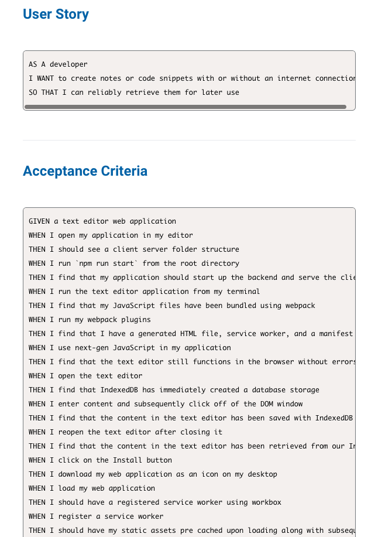
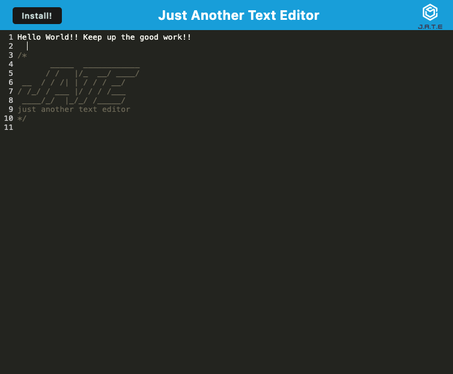

# PWA-Text-Trove

Progressive Web Applications - Text Editor 

## Description

Just Another Web Application or J.A.T.E. is a single-page Progressive Web App (PWA) that runs in the browser. It incorporates various data persistent techniques and works offline, ensuring uninterrupted functionality. The application features a client-server folder structure and is bundled using webpack. Content entered in the text editor is automatically saved in IndexedDB, allowing for retrieval when reopening the application. The app provides an Install button for desktop icon download and registers a service worker using workbox, enabling pre-caching of static assets.

## Installation / Usage 

To use this text trove application, navigate to the root directory and run npm install to install the dependencies. Next, run npm start to start the backend server and the client. The JavaScript files are bundled using webpack, and necessary plugins generate an HTML file, service worker, and manifest file. IndexedDB creates immediate database storage upon opening the editor, saving entered content automatically. When reopening the application, the content is retrieved from IndexedDB. Clicking the Install button allows you to download the web app as a desktop icon.

## License

MIT License 

## Deployment Page 

https://pwa-text-trove.onrender.com

## Author

Dilek Nuredin 

https://github.com/dileknrdn 